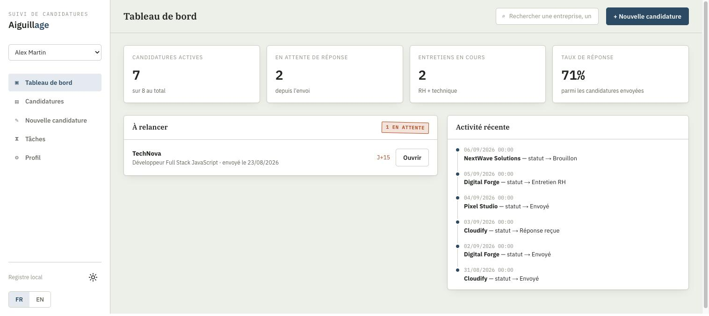
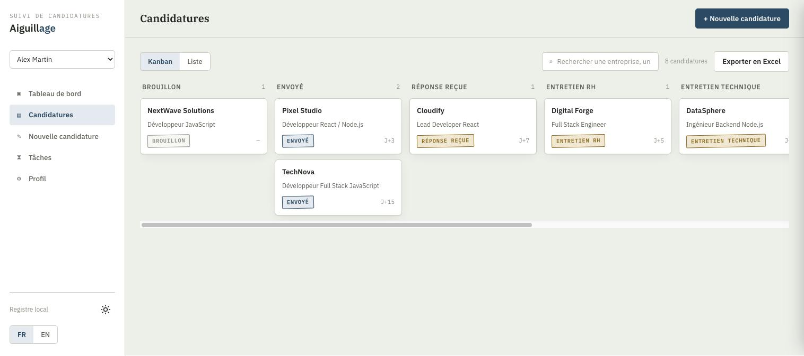
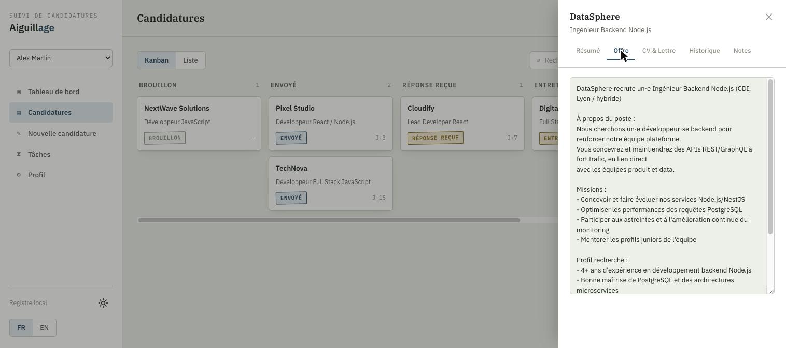

# Aiguillage

[](CHANGELOG.md)
[](LICENSE)

A personal job-application tracker: paste a job posting, the app generates a
tailored CV and cover letter (via Claude Code), you review and approve them,
and each application then moves along its own track — status, follow-ups,
history — toward its destination.

> **Note:** the interface language (French/English) is switchable from the
> sidebar and also controls the language of the generated CV and cover
> letter.

This project is built for **local** use — there's no authentication or
network multi-tenancy. It supports several local profiles though (useful if
more than one person in your household job-hunts with it), each with its own
fully separate board, tasks, and generated documents. It's open source so
others can reuse it, adapt it, or take inspiration from it with their own
profile.

## Screenshots

|                          Dashboard                          |                        Kanban board                         |                       Application detail                       |
| :-----------------------------------------------------------: | :-----------------------------------------------------------: | :----------------------------------------------------------: |
|  |  |  |

*(Screenshots use sample data — not a real job search.)*

## Features

- Analyzes a plain-text job posting — or just its link — with Claude Code
  (headless), based on your profile, to propose a tailored CV and cover
  letter.
- Offer discovery ("Découverte" page): scans the France Travail job-search
  API for postings matching your keywords/location, scores each new one
  against your profile, and surfaces the ones above a threshold you set —
  with the same fit card, and a one-click "Generate CV & apply" straight
  into the wizard. Requires France Travail API credentials — see
  [Offer discovery setup](#offer-discovery-setup) below.
- Import an application made outside the app: drop the CV you actually sent
  (for backup) and optionally the cover letter, paste whatever context is
  on hand — the posting, a confirmation email, a few words — and the
  company, role, source, and application date are identified automatically
  instead of filling in a blank form.
- Job-fit assessment on every analysis: a match score, an apply/maybe/skip
  read, and a category breakdown (must-haves, nice-to-haves, domain fit,
  constraints, seniority) shown as a radar chart and score meter.
- Review and edit the proposed content before generating documents, with a
  live CV preview.
- Generates `.docx` documents (dedicated Python service).
- Analysis and generation run as background tasks (a "Tâches" page + sidebar
  badge track their status), so you can start one on your laptop, close the
  tab, and pick the review back up from your phone on the same Wi-Fi.
- Several local profiles, switchable from the sidebar, each with its own
  fully separate Kanban board, dashboard, tasks, and generated documents —
  useful if more than one person uses the app.
- Dashboard: active applications, awaiting response, ongoing interviews,
  response rate, follow-ups due, recent activity, and a status breakdown
  pie chart.
- Kanban view (drag a card to another column to change its status) and list
  view.
- Detail panel per application: status, the original job posting (handy for
  interview prep), generated documents, status-change history, free-form
  notes, and a follow-up tab (mark as followed up, history, a configurable
  delay, and an AI-drafted follow-up message).
- CLI tracking (`tracker/tracker_cli.py`) alongside the dashboard.
- French/English interface switch, also used as the generation language for
  the CV and cover letter — with an option to generate both languages at
  once (two separate files per document).
- Profile editor with a proper form (identity, skills, experience,
  education, certifications, languages, personal projects) instead of raw
  JSON, and can also be filled in by importing an existing CV (PDF or DOCX).
- Excel export of all applications and their full status-change history, for
  analysis outside the app.
- QR code printed in the terminal when the dev server is ready, to open the
  board straight from your phone.
- Responsive UI, usable on mobile.

## Requirements

- [Claude Code](https://claude.com/claude-code) installed and authenticated
  on the command line (`claude`) — used headless to analyze job postings.
- Node.js 20+ and npm.
- Python 3.10+.

## Setup

1. **Clone the repo, then create your profile.** Start the app and use the
   **Profile** page to create a profile, then either fill it in by hand or
   import your existing CV (PDF/DOCX) — it extracts your information and
   lets you review it before saving. Add more profiles the same way if more
   than one person will use the app; switch between them from the sidebar.
   Profiles live under `profile/profiles/` and hold personal data: the whole
   folder is git-ignored and should never be committed.

2. **CV generation service** (`services/cv-generator`):

   ```bash
   cd services/cv-generator
   python3 -m venv venv
   source venv/bin/activate
   pip install -r requirements.txt
   ```

3. **Dashboard** (`dashboard/`):

   ```bash
   cd dashboard
   npm install
   ```

4. **Tracking database** (`tracker/`):

   ```bash
   cd tracker
   python3 db.py init   # creates data/applications.db from schema.sql
   ```

## Running

```bash
./start.sh
```

Starts the CV generation service (port 8000) then the dashboard
(`http://localhost:3000`).

The dashboard's dev server also prints a QR code in the terminal once it's
ready, linking straight to the Candidatures board on your phone (same
Wi-Fi).

## Offer discovery setup

The "Découverte" page scans [France Travail](https://francetravail.io)'s
official, free job-search API — the only source wired up for now. **There is
no comparable public API for APEC**: when APEC shares a posting with France
Travail, it already surfaces through this same API, so a separate APEC
integration would just be a fake dev-facing endpoint you can't actually call.

To enable it:

1. Create an account and a "France Travail Connect" app on
   [francetravail.io](https://francetravail.io) (free), and subscribe the app
   to the "Offres d'emploi" API. When the registration form asks for an
   "URL d'accès" (the site where the API is used), use this repo's URL — the
   app has no public deployment, and this flow doesn't use OAuth redirects
   anyway.
2. Copy the app's client ID and secret into `dashboard/.env.local` (create the
   file if it doesn't exist — it's git-ignored, never commit real
   credentials):

   ```
   FRANCE_TRAVAIL_CLIENT_ID=your-client-id
   FRANCE_TRAVAIL_CLIENT_SECRET=your-client-secret
   ```

3. Restart the dashboard. Without these two variables set, "Découverte" stays
   visible but every scan fails with a clear "not configured" error instead
   of silently doing nothing.

Search keywords, location, and the minimum fit score are configured per
profile, in a "Recherche d'offres" section on the **Profile** page. Scanning
is manual for now ("Scan now" button) — no scheduled/background scanning yet.

## Tracking applications from the CLI

```bash
cd tracker
python3 tracker_cli.py add --company "Acme" --role "Full Stack Dev" --status draft
python3 tracker_cli.py list
```

## Project structure

```
dashboard/               Next.js — dashboard, Kanban, application wizard
services/cv-generator/   FastAPI + python-docx — .docx generation
tracker/                 Python CLI + SQLite schema for tracking
profile/                 Your profile(s) (profiles/*.json, git-ignored)
data/                    SQLite database + generated documents (git-ignored)
```

## License

This project is distributed under the [MIT](LICENSE) license.
